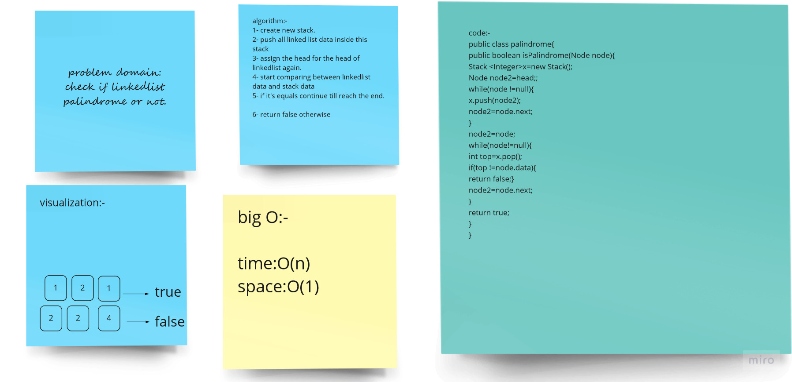
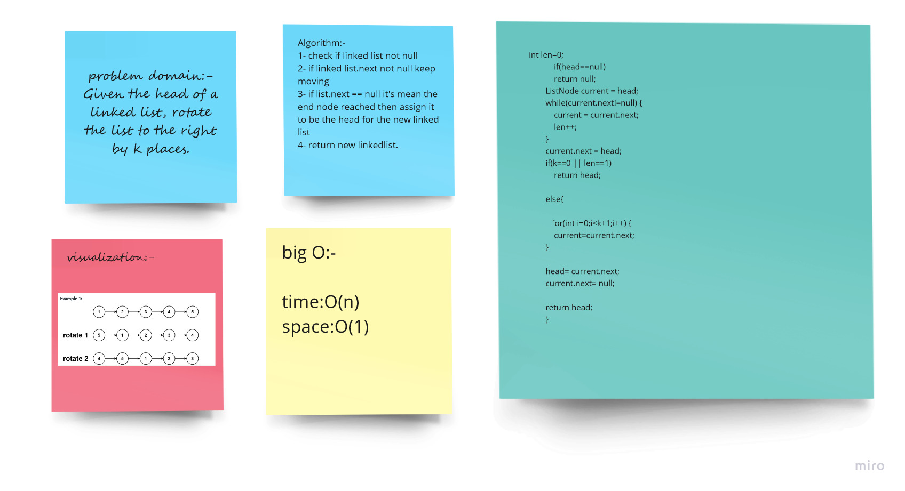
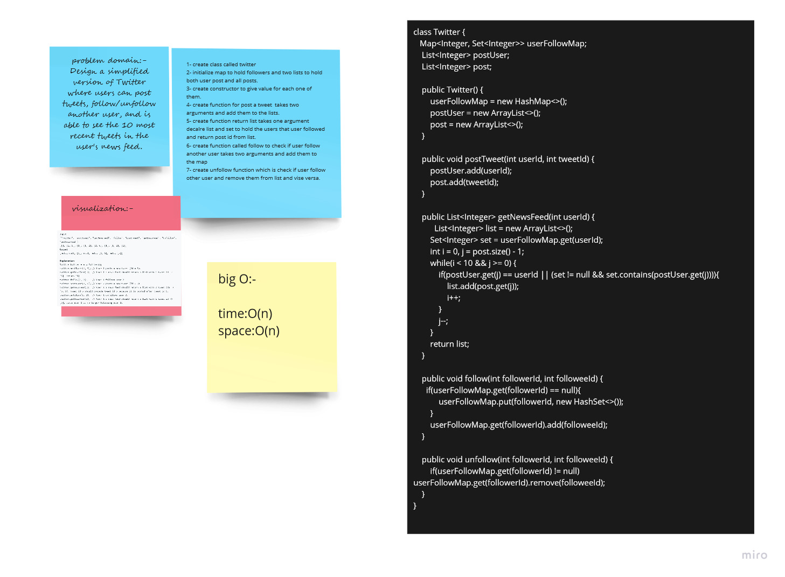

# DataStructre-problemSolving-practice
## [linked list](https://leetcode.com/tag/linked-list/)
#### approach:-
**solving 2 easy challenges/2 meduim challenges and all hard challenges**
- [X] 2 easy
- [X] 2 meduim
- [ ] hards

-[ ] whiteboards
##### Easy:-
***[is Palindrome](https://leetcode.com/problems/palindrome-linked-list/)***

***[Remove from linkedlist](https://leetcode.com/problems/remove-linked-list-elements/)***
#### Meduim:-
***[Rotate Right](https://leetcode.com/problems/rotate-list/)***

***[Twitter Design](https://leetcode.com/problems/design-twitter/)***

## [Stacks](https://leetcode.com/tag/stack/)
#### approach:-
**solving 2 easy challenges/2 meduim challenges and all hard challenges**

## [Queues](https://leetcode.com/tag/queue/)
#### approach:-
**solving 2 easy challenges/2 meduim challenges and all hard challenges**

### whiteBoard process:-
***is Palindrome***

***Remove from Linked List***

***Rotate Right***

***Twitter Design***

